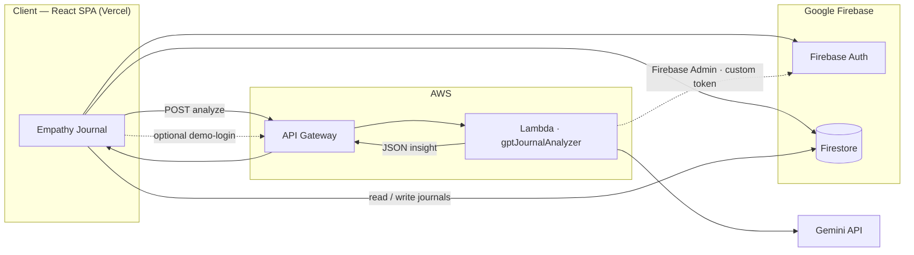

# Empathy Journal: Reflection.ai 🌿

Empathy Journal is a digital space designed to help users reflect on their thoughts, understand emotional patterns, and build consistent mental health habits. It combines a minimalist writing experience with structured AI insights and a wellness toolkit.

- **Live demo**: `https://empathy-journal.vercel.app/`
- **Design**: [Figma workspace](https://www.figma.com/design/dELc6U7AwXP7aTnvTC5mnl/Empathy-Journal-AWS-Hackathon?node-id=0-1)

## Screenshot


---

## 🎯 Project Overview

### The Problem
Traditional journaling often feels like a one way street where thoughts are stored but rarely processed. During high stress periods, users can feel overwhelmed and lack immediate perspective or the right questions to help them navigate their emotions.

### The Solution
Empathy Journal acts as a supportive companion. It uses a serverless backend to analyze journal entries and provide structured Reflection Prompts that guide self discovery. To encourage consistency, it visualizes writing streaks as a gamified Digital Garden.

### ✨ Key Features

- Smart Journaling: on demand AI insight analysis for emotion, core themes, summary, and reflection prompts
- Reflection Prompts: automatically generates three tailored questions per analysis
- The Garden: a gamified streak garden that grows with consistent writing days
- Wellness Toolkit: includes a Pomodoro focus timer, ambient calm sounds, and a micro habit tracker with study todo support
- Auto Persistence: AI insight flow is automatically saved to Firestore so entries and insights remain available across sessions (demo content is cleared on logout)

### 🚧 Challenges I ran into

- AWS and AI Integration: building a reliable contract between Lambda and Gemini. I enforced a strict JSON schema and normalized the output so the frontend can render safely
- CORS and browser integration: configuring API Gateway and Lambda CORS headers for browser requests and handling error responses safely
- State Management: syncing Firestore real time listeners with the AI insight flow while maintaining clean UI state transitions

### 🏆 Accomplishments that I am proud of

- Successful serverless implementation: built a fully functional, secure, and scalable backend on AWS powering AI insights
- High quality AI prompt and schema design: crafted a prompt that returns stable JSON for UI fields including emotion, themes, summary, and reflection prompts
- User centric product delivery: end to end journaling, Digital Garden streak analytics, and a wellness toolkit that keeps the experience calm

### 📚 What I learned

- AWS ecosystem: deeper understanding of Lambda, API Gateway, and CloudWatch observability
- AI orchestration: refining prompt and output contracts and validating results through API calls and UI behavior
- Product ownership: balancing technical complexity with a simple, healing user experience

---

## Architecture

- **Frontend**: `empathy-journal-lambda/` React + Vite + Tailwind + Firebase Auth/Firestore
- **Backend**: `backend/lambda/gptJournalAnalyzer/` AWS Lambda function behind API Gateway for Gemini analysis

### Diagram

GitHub renders this Mermaid diagram in the README preview:



Solid lines: main journaling + AI path. Dotted: demo sign-in via Lambda (custom token), when used.

### Request flow

1. User writes a journal entry and clicks **AI Insight**
2. Frontend sends `POST` to API Gateway (`VITE_LAMBDA_URL`)
3. API Gateway triggers Lambda
4. Lambda calls Gemini and normalizes output schema
5. Frontend shows the insight and **auto-saves** the entry (content + insight) to Firestore so it survives tab changes and reloads (demo data is still cleared on **logout**)
6. **Save Journal** remains for entries without running AI, or if auto-save fails

---

## Tech Stack

- **Frontend**: React, Vite, Tailwind CSS, React Router
- **Auth / Database**: Firebase Auth, Firestore
- **Backend**: AWS Lambda (Node.js), API Gateway, Firebase Admin (e.g. demo custom tokens), Gemini integration via REST call + strict JSON normalization
- **AI**: Google Gemini (`gemini-2.5-flash`)
- **Observability / Testing**: CloudWatch Logs, Postman/Hoppscotch, local smoke test script
- **Deployment**: Vercel (frontend), AWS Lambda (backend)

---

## Features

- **Journaling + AI Insight**
  - Analyze entries for emotion, themes, summary, and reflection prompts
  - Generate `suggested_actions` as micro next steps the user can do in a few minutes
  - Successful analyses are persisted automatically (no extra “save” step for the insight flow)
- **Analytics**
  - Emotion trends and dashboard copy use **AI-analyzed** journal entries only (entries saved without insight are not counted as “Unknown”)
  - **Digital Garden (streak garden)** grows from consistent writing days to visualize progress and keep users engaged
- **Toolkit**
  - Focus mode (Pomodoro), calm sounds, micro-habits, study todo list
- **Authentication + Profile**
  - Email/password + Google login
  - User profile + UI theme preferences
- **Demo account**
  - Demo login via Lambda custom token or, in local dev, email/password (`VITE_DEMO_EMAIL` / `VITE_DEMO_PASSWORD`); if the demo-login API fails locally, dev password sign-in is used as a fallback
  - Demo Firestore content is cleared on logout
- **Demo Helpers**
  - DEV-only demo seeding tools for presentation

---

## AWS + AI Implementation Notes

Because this project was built for an AWS hackathon, the serverless backend is intentionally explicit:

- Lambda validates input and handles CORS
- Lambda calls Gemini and enforces a stable JSON output schema
- The system prompt instructs Gemini to act as a mental wellness reflection assistant and return strictly valid JSON (no markdown)
- `suggested_actions` is normalized to 1 to 3 micro actions for UI consistency
- `reflection_prompts` is normalized to exactly 3 items for UI consistency
- Errors are mapped to user-safe responses (`400`, `429`, `500/502`)

---

## Local Development

### Frontend

```bash
cd empathy-journal-lambda
npm install
npm run dev
```

Create `empathy-journal-lambda/.env`:

```bash
VITE_LAMBDA_URL="https://<your-api-gateway-endpoint>"
VITE_FIREBASE_API_KEY="..."
VITE_FIREBASE_AUTH_DOMAIN="..."
VITE_FIREBASE_PROJECT_ID="..."
VITE_FIREBASE_STORAGE_BUCKET="..."
VITE_FIREBASE_MESSAGING_SENDER_ID="..."
VITE_FIREBASE_APP_ID="..."
VITE_FIREBASE_MEASUREMENT_ID="..."
```

**Local demo login (optional):** If `POST` to the demo-login URL fails (e.g. CORS or wrong URL), set `VITE_DEMO_PASSWORD` (and matching `VITE_DEMO_EMAIL` for your Firebase demo user) so `npm run dev` can sign in without that call. See `empathy-journal-lambda/.env.example`.

### Backend (Lambda local invoke + smoke test)

```bash
cd backend/lambda/gptJournalAnalyzer
npm install
cp .env.example .env
# set GEMINI_API_KEY in .env
npm run invoke:local
npm run test:smoke
```

---

## Documentation Index

For full design and implementation docs, see:

- `docs/README.md`
- Frontend:
  - `docs/frontend/figma.md`
  - `docs/frontend/theme.md`
  - `docs/frontend/components.md`
  - `docs/frontend/pages/*.md`
- Backend:
  - `docs/backend/api.md`
  - `docs/backend/implementation.md`
  - `docs/backend/observability.md`

---

## Future Roadmap

- Optimization: add route-level code splitting and further bundle optimization
- Resilience: improve AI fallback handling for quota limits or timeouts
- Engagement: implement chat summarization and personalized mood-based music suggestions
- Privacy: explore end-to-end encryption for sensitive journal content
- Quality: expand test coverage (frontend components and API contract checks)
